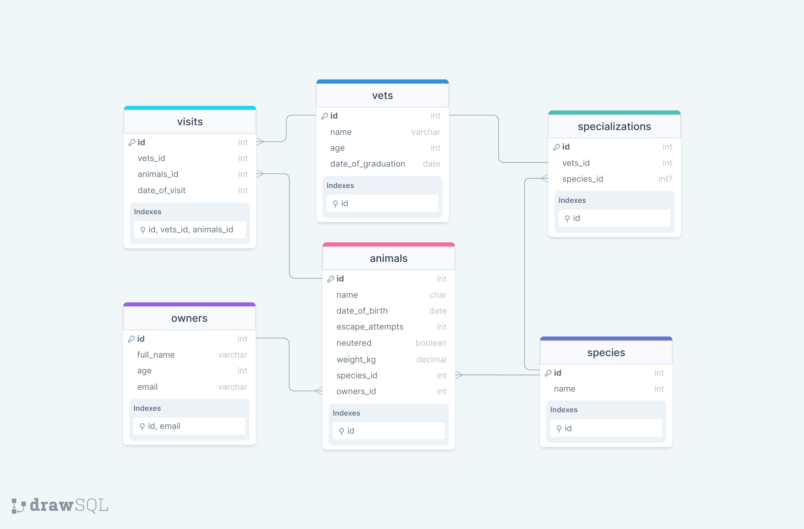

# vet-clinic

> My first PostgreSQL Database

## Entitiy Relationship Diagram of Vet-Clinic-Database

## Getting Started

This repository includes files with plain SQL that can be used to recreate a database:

- Use [schema.sql](./schema.sql) to create all tables.
- Use [data.sql](./data.sql) to populate tables with sample data.
- Check [queries.sql](./queries.sql) for examples of queries that can be run on a newly created database. **Important note: this file might include queries that make changes in the database (e.g., remove records). Use them responsibly!**

## Authors

👤 Angom Chittaranjan

- GitHub: [@AngomRanjan](https://github.com/AngomRanjan)
- Twitter: [@RanjanAngom](https://twitter.com/RanjanAngom)
- LinkedIn: [angom-chittaranjan](https://linkedin.com/in/angom-chittaranjan)

👤 Nizamuddin Ahmadzai

- GitHub: [@Nizamudin4493](https://github.com/Nizamudin4493)
- Twitter: [@Nizamudin4493](https://twitter.com/Nizamudin4493)
- LinkedIn: [nizamudin4493](https://linkedin.com/in/nizamudin4493)

## 🤝 Contributing

Contributions, issues, and feature requests are welcome!

Feel free to check the [issues page](https://github.com/AngomRanjan/vet-clinic/issues).

## Show your support

Give a [⭐️](https://github.com/AngomRanjan/vet-clinic/stargazers) if you like this project!

## :footprints: Track Me

## Acknowledgments
- Microverse Team.
- My Family.
- All my fellow micronauts.

## 📝 License

This project is [MIT](LICENSE) licensed.
